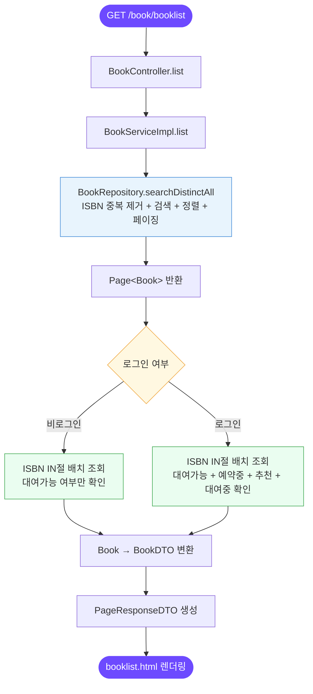
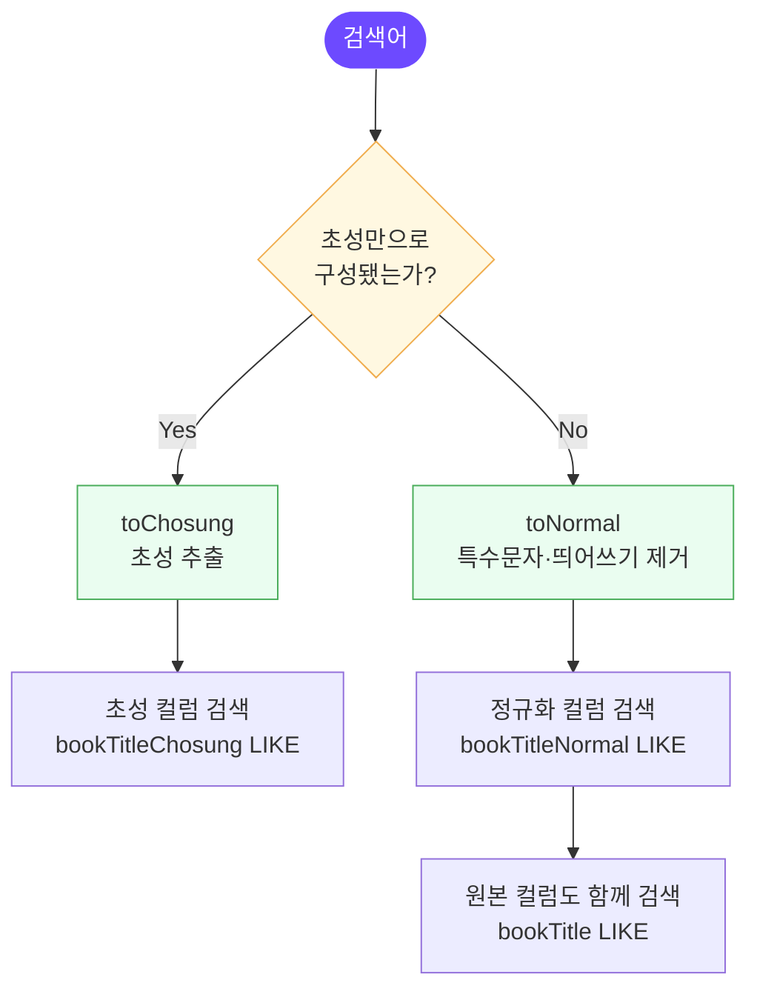

# 📖 담당 기능 - 도서 관리 및 검색

> 도서관 관리 시스템 내 도서 목록 조회, 검색, 추천 기능 담당

**담당자**: 오태흔

---

## 📌 담당 기능 목록

| 기능 | 설명 |
|------|------|
| 도서 목록 조회 | ISBN 기반 중복 제거, 페이지네이션 |
| 도서 검색 | 다중 필드 검색 + 초성/정규화 검색 |
| 검색 결과 정렬 | 5가지 정렬 옵션 + 우선순위 적용 |
| 검색 키워드 하이라이팅 | 목록 및 상세 모달에서 키워드 마킹 |
| 도서 추천 | ♡/♥ 토글, 중복 방지 |
| N+1 쿼리 최적화 | 21개 → 5개 쿼리 (76% 감소) |

---

## 🗂 담당 파일 구조

| 계층 | 파일 | 역할 |
|------|------|------|
| Controller | `BookController` | 목록 페이지 렌더링 |
| Controller | `BookRestController` | 상세조회, 추천/취소 API |
| Service | `BookServiceImpl` | 검색 로직, 배치 쿼리, DTO 변환 |
| Repository | `BookSearchImpl` | QueryDSL 동적 검색/정렬 |
| Utility | `KoreanDecomposer` | 초성 추출, 텍스트 정규화 |
| Frontend | `booklist.html` + `booklist.js` | UI 렌더링, AJAX, 이벤트 위임 |

---

## 🔍 도서 목록 조회 흐름



---

## 🔎 검색 시스템

### 검색 우선순위


### KoreanDecomposer 처리 흐름



---

## 📊 정렬 옵션

| 정렬값 | 설명 | 방식 |
|--------|------|------|
| `id` (기본) | 최신 등록순 | `book.id DESC` |
| `pubdate` | 출판일순 | `book.pubdate DESC` |
| `bookTitle` | 제목 가나다순 | `book.bookTitle ASC` |
| `recommend` | 추천수 많은순 | `LEFT JOIN + COUNT DESC` |
| `rental` | 대출 빈도순 | `LEFT JOIN + COUNT DESC` |

> 검색어가 있을 경우 선택 정렬 기준 적용 후, 우선순위(priority) 컬럼을 추가로 정렬해 검색 관련도 높은 결과가 상위에 노출됨

---

## ⚡ N+1 쿼리 최적화

### 개선 전 / 후

| | 쿼리 수 | 방식 |
|-|---------|------|
| 개선 전 | 21개 | 책 10건 루프 내 개별 DB 조회 |
| 개선 후 | 5개 | ISBN 목록 IN절 배치 조회 |

### 배치 조회 항목

```
1. searchDistinctAll    → ISBN 중복 제거된 도서 목록
2. findAvailableIsbnIn  → 대여 가능 여부
3. findBookIsbnsByMemberIdAndBookIsbnInAndStatus  → 예약 중 여부
4. findBookIdsByBookIsbnIn  → 추천 여부
5. findRentedIsbnsByMemberIdAndIsbnIn  → 대여 중 여부
```

> `HashSet` O(1) 룩업으로 루프 내 추가 조회 없이 DTO 변환

---

## 🐛 트러블슈팅

### 대여 예약 중복 신청 문제
- **문제**: 고정된 `book_id` 기준으로 중복 체크 → 같은 책의 다른 복본에 중복 예약 가능
- **해결**: `isbn` + 상태값으로 `book_id`를 동적으로 탐색하는 로직 추가

### 검색 정확성 문제 (초성 오탐)
- **문제**: "데미안" 검색 시 초성 `ㄷㅁㅇ`이 "동물의세계(`ㄷㅁㅇㅅㄱ`)"도 함께 검색됨
- **해결**: 검색어가 순수 초성으로만 구성된 경우에만 초성 컬럼 검색 로직 적용

### 검색 결과 정렬 우선순위 문제
- **문제**: 제목 직접 매칭 결과와 설명에서 매칭된 결과가 뒤섞여 출력
- **해결**: `NumberExpression` + CASE 구문으로 가상 `priority` 컬럼 생성, 정렬 기준에 추가
